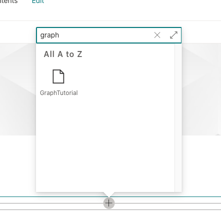

<!-- markdownlint-disable MD002 MD041 -->

<span data-ttu-id="f12f5-101">A estrutura do SharePoint elimina a necessidade de registrar um aplicativo no Azure AD para obter tokens de acesso para acessar o Microsoft Graph.</span><span class="sxs-lookup"><span data-stu-id="f12f5-101">The SharePoint Framework eliminates the need to register an application in Azure AD for getting access tokens to access Microsoft Graph.</span></span> <span data-ttu-id="f12f5-102">Ele trata da autenticação do usuário que está conectado ao SharePoint, permitindo que a Web Part obtenha tokens de usuário.</span><span class="sxs-lookup"><span data-stu-id="f12f5-102">It handles the authentication for the user that is logged into SharePoint, allowing your web part to get user tokens.</span></span> <span data-ttu-id="f12f5-103">A Web Part precisa indicar quais [escopos de permissão de gráfico](https://docs.microsoft.com/graph/permissions-reference) são necessários e um administrador de locatários pode aprovar essas permissões durante a instalação.</span><span class="sxs-lookup"><span data-stu-id="f12f5-103">Your web part needs to indicate which [Graph permission scopes](https://docs.microsoft.com/graph/permissions-reference) it requires, and a tenant admin can approve those permissions during installation.</span></span>

## <a name="configure-permissions"></a><span data-ttu-id="f12f5-104">Configurar permissões</span><span class="sxs-lookup"><span data-stu-id="f12f5-104">Configure permissions</span></span>

1. <span data-ttu-id="f12f5-105">Abrir **./config/package-solution.jsem**.</span><span class="sxs-lookup"><span data-stu-id="f12f5-105">Open **./config/package-solution.json**.</span></span>

1. <span data-ttu-id="f12f5-106">Adicione o seguinte código à `solution` propriedade.</span><span class="sxs-lookup"><span data-stu-id="f12f5-106">Add the following code to the `solution` property.</span></span>

    ```json
    "webApiPermissionRequests": [
      {
        "resource": "Microsoft Graph",
        "scope": "Calendars.ReadWrite"
      },
      {
        "resource": "Microsoft Graph",
        "scope": "User.ReadBasic.All"
      },
      {
        "resource": "Microsoft Graph",
        "scope": "Contacts.Read"
      },
      {
        "resource": "Microsoft Graph",
        "scope": "People.Read"
      }
    ]
    ```

<span data-ttu-id="f12f5-107">A `Calendars.ReadWrite` permissão permite que a Web Part recupere o calendário do usuário e adicione eventos usando o Microsoft Graph.</span><span class="sxs-lookup"><span data-stu-id="f12f5-107">The `Calendars.ReadWrite` permission allows your web part to retrieve the user's calendar and add events using Microsoft Graph.</span></span> <span data-ttu-id="f12f5-108">As outras permissões são usadas por componentes no Microsoft Graph Toolkit para renderizar informações sobre participantes e organizadores de eventos.</span><span class="sxs-lookup"><span data-stu-id="f12f5-108">The other permissions are used by components in the Microsoft Graph Toolkit to render information about event attendees and organizers.</span></span>

## <a name="optional-test-token-acquisition"></a><span data-ttu-id="f12f5-109">Opcional: aquisição de token de teste</span><span class="sxs-lookup"><span data-stu-id="f12f5-109">Optional: Test token acquisition</span></span>

> [!NOTE]
> <span data-ttu-id="f12f5-110">O restante das etapas nesta página são opcionais.</span><span class="sxs-lookup"><span data-stu-id="f12f5-110">The rest of the steps on this page are optional.</span></span> <span data-ttu-id="f12f5-111">Se preferir acessar a codificação do Microsoft Graph imediatamente, você pode prosseguir para [obter um modo de exibição de calendário](/graph/tutorials/spfx?tutorial-step=3).</span><span class="sxs-lookup"><span data-stu-id="f12f5-111">If you'd prefer to get to the Microsoft Graph coding right away, you can proceed to [Get a calendar view](/graph/tutorials/spfx?tutorial-step=3).</span></span>

<span data-ttu-id="f12f5-112">Vamos adicionar um código temporário à Web Part para testar a aquisição de tokens.</span><span class="sxs-lookup"><span data-stu-id="f12f5-112">Let's add some temporary code to the web part to test token acquisition.</span></span>

1. <span data-ttu-id="f12f5-113">Abra **./src/WebParts/graphTutorial/GraphTutorialWebPart.TS** e adicione a instrução a seguir `import` na parte superior do arquivo.</span><span class="sxs-lookup"><span data-stu-id="f12f5-113">Open **./src/webparts/graphTutorial/GraphTutorialWebPart.ts** and add the following `import` statement at the top of the file.</span></span>

    ```typescript
    import { AadTokenProvider } from '@microsoft/sp-http';
    ```

1. <span data-ttu-id="f12f5-114">Substitua a função `render` existente pelo seguinte.</span><span class="sxs-lookup"><span data-stu-id="f12f5-114">Replace the existing `render` function with the following.</span></span>

    ```typescript
    public render(): void {
    this.context.aadTokenProviderFactory
      .getTokenProvider()
      .then((provider: AadTokenProvider)=> {
      provider
        .getToken('https://graph.microsoft.com')
        .then((token: string) => {
          this.domElement.innerHTML = `
          <div class="${ styles.graphTutorial }">
            <div class="${ styles.container }">
              <div class="${ styles.row }">
                <div class="${ styles.column }">
                  <span class="${ styles.title }">Welcome to SharePoint!</span>
                  <p><code style="word-break: break-all;">${ token }</code></p>
                </div>
              </div>
            </div>
          </div>`;
        });
      });
    }
    ```

### <a name="deploy-the-web-part"></a><span data-ttu-id="f12f5-115">Implantar a Web Part</span><span class="sxs-lookup"><span data-stu-id="f12f5-115">Deploy the web part</span></span>

1. <span data-ttu-id="f12f5-116">Execute os dois comandos a seguir em sua CLI para criar e empacotar a Web Part.</span><span class="sxs-lookup"><span data-stu-id="f12f5-116">Run the following two commands in your CLI to build and package your web part.</span></span>

    ```Shell
    gulp bundle --ship
    gulp package-solution --ship
    ```

1. <span data-ttu-id="f12f5-117">Abra o navegador e vá para o catálogo de aplicativos do SharePoint do locatário.</span><span class="sxs-lookup"><span data-stu-id="f12f5-117">Open your browser and go to your tenant's SharePoint App Catalog.</span></span> <span data-ttu-id="f12f5-118">Selecione o item **de menu aplicativos para SharePoint** no lado esquerdo.</span><span class="sxs-lookup"><span data-stu-id="f12f5-118">Select the **Apps for SharePoint** menu item on the left-hand side.</span></span>

1. <span data-ttu-id="f12f5-119">Carregar o arquivo **./SharePoint/Solution/Graph-tutorial.sppkg** .</span><span class="sxs-lookup"><span data-stu-id="f12f5-119">Upload the **./sharepoint/solution/graph-tutorial.sppkg** file.</span></span>

1. <span data-ttu-id="f12f5-120">No prompt **confiar...** , confirme se o prompt lista as 4 permissões do Microsoft Graph definidas na **package-solution.jsem** arquivo.</span><span class="sxs-lookup"><span data-stu-id="f12f5-120">In the **Do you trust...** prompt, confirm that the prompt lists the 4 Microsoft Graph permissions you set in the **package-solution.json** file.</span></span> <span data-ttu-id="f12f5-121">Selecione **tornar esta solução disponível para todos os sites na organização** e selecione **implantar**.</span><span class="sxs-lookup"><span data-stu-id="f12f5-121">Select **Make this solution available to all sites in the organization** , then select **Deploy**.</span></span>

1. <span data-ttu-id="f12f5-122">Vá para o [centro de administração do SharePoint](https://admin.microsoft.com/sharepoint?page=classicfeatures&modern=true) usando um administrador de locatários.</span><span class="sxs-lookup"><span data-stu-id="f12f5-122">Go to the [SharePoint admin center](https://admin.microsoft.com/sharepoint?page=classicfeatures&modern=true) using a tenant administrator.</span></span>

1. <span data-ttu-id="f12f5-123">No menu à esquerda, selecione **avançado** e, em seguida, **acesso à API**.</span><span class="sxs-lookup"><span data-stu-id="f12f5-123">In the left-hand menu, select **Advanced** , then **API access**.</span></span>

1. <span data-ttu-id="f12f5-124">Selecione cada uma das solicitações pendentes do pacote **gráfico-tutorial-cliente-solução** e escolha **aprovar**.</span><span class="sxs-lookup"><span data-stu-id="f12f5-124">Select each of the pending requests from the **graph-tutorial-client-side-solution** package and choose **Approve**.</span></span>

    

### <a name="test-the-web-part"></a><span data-ttu-id="f12f5-126">Testar a Web Part</span><span class="sxs-lookup"><span data-stu-id="f12f5-126">Test the web part</span></span>

1. <span data-ttu-id="f12f5-127">Vá para um site do SharePoint onde você deseja testar a Web Part.</span><span class="sxs-lookup"><span data-stu-id="f12f5-127">Go to a SharePoint site where you want to test the web part.</span></span> <span data-ttu-id="f12f5-128">Crie uma nova página para testar a Web Part.</span><span class="sxs-lookup"><span data-stu-id="f12f5-128">Create a new page to test the web part on.</span></span>

1. <span data-ttu-id="f12f5-129">Use o seletor de Web Part para localizar a Web Part **GraphTutorial** e adicioná-la à página.</span><span class="sxs-lookup"><span data-stu-id="f12f5-129">Use the web part picker to find the **GraphTutorial** web part and add it to the page.</span></span>

    

1. <span data-ttu-id="f12f5-131">O token de acesso é impresso abaixo do **Bem-vindo ao SharePoint!**</span><span class="sxs-lookup"><span data-stu-id="f12f5-131">The access token is printed below the **Welcome to SharePoint!**</span></span> <span data-ttu-id="f12f5-132">mensagem na Web Part.</span><span class="sxs-lookup"><span data-stu-id="f12f5-132">message in the web part.</span></span> <span data-ttu-id="f12f5-133">Você pode copiar esse token e analisá-lo [https://jwt.ms/](https://jwt.ms/) para confirmar se ele contém os escopos de permissão exigidos pela Web Part.</span><span class="sxs-lookup"><span data-stu-id="f12f5-133">You can copy this token and parse it at [https://jwt.ms/](https://jwt.ms/) to confirm that it contains the permission scopes required by the web part.</span></span>

    
