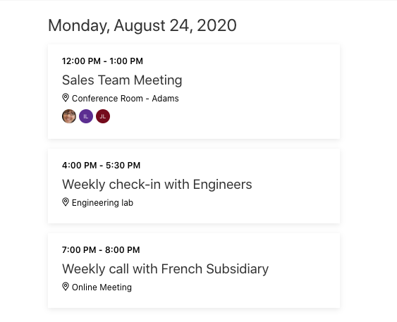

<!-- markdownlint-disable MD002 MD041 -->

<span data-ttu-id="1dd8c-101">Nesta seção, você usará o [Kit de ferramentas do Microsoft Graph](https://docs.microsoft.com/graph/toolkit/overview) para substituir a lista simples de eventos pela interface do usuário avançada.</span><span class="sxs-lookup"><span data-stu-id="1dd8c-101">In this section, you'll use the [Microsoft Graph Toolkit](https://docs.microsoft.com/graph/toolkit/overview) to replace the simple list of events with rich UI.</span></span>

<span data-ttu-id="1dd8c-102">O kit de ferramentas fornece um [componente de agenda](https://docs.microsoft.com/graph/toolkit/components/agenda), que é bem adequado para renderizar nossa lista de eventos.</span><span class="sxs-lookup"><span data-stu-id="1dd8c-102">The toolkit provides an [Agenda component](https://docs.microsoft.com/graph/toolkit/components/agenda), which is well-suited to render our list of events.</span></span>

## <a name="update-the-web-part"></a><span data-ttu-id="1dd8c-103">Atualizar a Web Part</span><span class="sxs-lookup"><span data-stu-id="1dd8c-103">Update the web part</span></span>

1. <span data-ttu-id="1dd8c-104">Abra **./src/WebParts/graphTutorial/GraphTutorialWebPart.Module.SCSS**.</span><span class="sxs-lookup"><span data-stu-id="1dd8c-104">Open **./src/webparts/graphTutorial/GraphTutorialWebPart.module.scss**.</span></span> <span data-ttu-id="1dd8c-105">Altere o valor do `background-color` atributo na `.row` entrada para `$ms-color-white` .</span><span class="sxs-lookup"><span data-stu-id="1dd8c-105">Change the value of the `background-color` attribute in the `.row` entry to `$ms-color-white`.</span></span>

    :::code language="css" source="../demo/graph-tutorial/src/webparts/graphTutorial/GraphTutorialWebPart.module.scss" id="rowScssSnippet" highlight="4":::

1. <span data-ttu-id="1dd8c-106">Adicione a seguinte entrada dentro da `.graphTutorial` entrada.</span><span class="sxs-lookup"><span data-stu-id="1dd8c-106">Add the following entry inside the `.graphTutorial` entry.</span></span>

    :::code language="css" source="../demo/graph-tutorial/src/webparts/graphTutorial/GraphTutorialWebPart.module.scss" id="addSocialBtnSnippet":::

1. <span data-ttu-id="1dd8c-107">Abra **./src/WebParts/graphTutorial/GraphTutorialWebPart.TS** e adicione a instrução a seguir `import` na parte superior do arquivo.</span><span class="sxs-lookup"><span data-stu-id="1dd8c-107">Open **./src/webparts/graphTutorial/GraphTutorialWebPart.ts** and add the following `import` statement at the top of the file.</span></span>

    ```typescript
    import { Providers, SharePointProvider, MgtAgenda } from '@microsoft/mgt';
    ```

1. <span data-ttu-id="1dd8c-108">Adicione a função a seguir à classe **GraphTutorialWebPart** para inicializar o kit de ferramentas.</span><span class="sxs-lookup"><span data-stu-id="1dd8c-108">Add the following function to the **GraphTutorialWebPart** class to initialize the toolkit.</span></span>

    :::code language="typescript" source="../demo/graph-tutorial/src/webparts/graphTutorial/GraphTutorialWebPart.ts" id="onInitSnippet":::

1. <span data-ttu-id="1dd8c-109">Substitua a função `renderCalendarView` existente pelo seguinte.</span><span class="sxs-lookup"><span data-stu-id="1dd8c-109">Replace the existing `renderCalendarView` function with the following.</span></span>

    :::code language="typescript" source="../demo/graph-tutorial/src/webparts/graphTutorial/GraphTutorialWebPart.ts" id="renderCalendarViewSnippet":::

    <span data-ttu-id="1dd8c-110">Isso substitui a lista básica pelo componente de **agenda** do kit de ferramentas.</span><span class="sxs-lookup"><span data-stu-id="1dd8c-110">This replaces the basic list with the **Agenda** component from the toolkit.</span></span>

1. <span data-ttu-id="1dd8c-111">Criar, empacotar e recarregar a Web Part e, em seguida, atualizar a página em que você está testando.</span><span class="sxs-lookup"><span data-stu-id="1dd8c-111">Build, package, and re-upload the web part, then refresh the page where you are testing it.</span></span>

    

## <a name="an-alternate-approach"></a><span data-ttu-id="1dd8c-113">Uma abordagem alternativa</span><span class="sxs-lookup"><span data-stu-id="1dd8c-113">An alternate approach</span></span>

<span data-ttu-id="1dd8c-114">Neste ponto, você tem um código que:</span><span class="sxs-lookup"><span data-stu-id="1dd8c-114">At this point, you have code that:</span></span>

- <span data-ttu-id="1dd8c-115">Usa o **MSGraphClient** para obter o modo de exibição de calendário do usuário para a semana atual do Microsoft Graph.</span><span class="sxs-lookup"><span data-stu-id="1dd8c-115">Uses the **MSGraphClient** to get the user's calendar view for the current week from Microsoft Graph.</span></span>
- <span data-ttu-id="1dd8c-116">Adicione esses eventos ao componente de **agenda** do kit de ferramentas do Microsoft Graph.</span><span class="sxs-lookup"><span data-stu-id="1dd8c-116">Add those events to the **Agenda** component from the Microsoft Graph Toolkit.</span></span>

<span data-ttu-id="1dd8c-117">Com essa abordagem, você tem controle total sobre a chamada de API de gráfico e pode fazer qualquer processamento dos eventos antes da renderização que você deseja.</span><span class="sxs-lookup"><span data-stu-id="1dd8c-117">With this approach, you have full control over the Graph API call and can do any processing of the events prior to rendering that you want.</span></span> <span data-ttu-id="1dd8c-118">No entanto, se isso não for necessário, você pode simplificar, permitindo que o componente de **agenda** faça o trabalho para você.</span><span class="sxs-lookup"><span data-stu-id="1dd8c-118">However, if that isn't required, you can simplify by letting the **Agenda** component do the work for you.</span></span>

<span data-ttu-id="1dd8c-119">Todos os componentes do Microsoft Graph Toolkit são capazes de fazer todas as chamadas de API relevantes para o Microsoft Graph.</span><span class="sxs-lookup"><span data-stu-id="1dd8c-119">All Microsoft Graph Toolkit components are capable of making all of the relevant API calls to the Microsoft Graph.</span></span> <span data-ttu-id="1dd8c-120">Por exemplo, basta adicionar o componente de **agenda** à Web Part e não definir nenhuma propriedade, a Web Part usaria suas configurações padrão para obter eventos para o dia atual.</span><span class="sxs-lookup"><span data-stu-id="1dd8c-120">For example, by just adding the **Agenda** component to the web part, and not setting any properties, the web part would use its default settings to get events for the current day.</span></span> <span data-ttu-id="1dd8c-121">Vamos ver como podemos obter os mesmos resultados que temos atualmente (eventos para a semana atual).</span><span class="sxs-lookup"><span data-stu-id="1dd8c-121">Let's look at how we can achieve the same results we currently have (events for the current week).</span></span>

1. <span data-ttu-id="1dd8c-122">Substitua o `render` método existente pelo seguinte.</span><span class="sxs-lookup"><span data-stu-id="1dd8c-122">Replace the existing `render` method with the following.</span></span>

    :::code language="typescript" source="../demo/graph-tutorial/src/webparts/graphTutorial/GraphTutorialWebPart.ts" id="alternateRenderSnippet":::

    <span data-ttu-id="1dd8c-123">Agora, em vez de fazer uma chamada de API no `render` , basta adicionar um `mgt-agenda` elemento diretamente ao HTML.</span><span class="sxs-lookup"><span data-stu-id="1dd8c-123">Now, instead of making an API call in `render`, you simply add an `mgt-agenda` element directly into the HTML.</span></span> <span data-ttu-id="1dd8c-124">Configurando `date` o início da semana e `days` para 7, o componente fará com que a mesma chamada de API seja `render` feita.</span><span class="sxs-lookup"><span data-stu-id="1dd8c-124">By setting `date` to the start of the week, and `days` to 7, the component will make the same API call the previous version of `render` was making.</span></span>

1. <span data-ttu-id="1dd8c-125">Adicione a seguinte função vazia à classe **GraphTutorialWebPart** .</span><span class="sxs-lookup"><span data-stu-id="1dd8c-125">Add the following empty function to the **GraphTutorialWebPart** class.</span></span>

    ```typescript
    private async addSocialToCalendar() {}
    ```

    > [!NOTE]
    > <span data-ttu-id="1dd8c-126">Também adicionamos um botão **Add Team social** à Web Part e adicionamos o `addSocialToCalendar` método como um ouvinte de eventos.</span><span class="sxs-lookup"><span data-stu-id="1dd8c-126">We also added an **Add team social** button to the web part, and added the `addSocialToCalendar` method as an event listener.</span></span>  <span data-ttu-id="1dd8c-127">Você implementará o código por trás da próxima seção.</span><span class="sxs-lookup"><span data-stu-id="1dd8c-127">You'll implement the code behind that in the next section.</span></span> <span data-ttu-id="1dd8c-128">Por enquanto, só queremos que o código seja compilado.</span><span class="sxs-lookup"><span data-stu-id="1dd8c-128">For now, we just want the code to compile.</span></span>

1. <span data-ttu-id="1dd8c-129">Criar, empacotar e recarregar a Web Part e, em seguida, atualizar a página em que você está testando.</span><span class="sxs-lookup"><span data-stu-id="1dd8c-129">Build, package, and re-upload the web part, then refresh the page where you are testing it.</span></span> <span data-ttu-id="1dd8c-130">O modo de exibição deve ser igual ao teste anterior.</span><span class="sxs-lookup"><span data-stu-id="1dd8c-130">The view should be the same as your previous test.</span></span>

### <a name="using-the-toolkit-vs-making-api-calls"></a><span data-ttu-id="1dd8c-131">Usando o kit de ferramentas vs fazendo chamadas de API</span><span class="sxs-lookup"><span data-stu-id="1dd8c-131">Using the toolkit vs making API calls</span></span>

<span data-ttu-id="1dd8c-132">Neste ponto, você pode estar se perguntando por que deu o problema de usar o **MSGraphClient** , quando o kit de ferramentas faz o trabalho para você.</span><span class="sxs-lookup"><span data-stu-id="1dd8c-132">At this point you may be wondering why you went through the trouble of using the **MSGraphClient** at all, when the toolkit does the work for you.</span></span> <span data-ttu-id="1dd8c-133">O kit de ferramentas foi projetado para renderizar os resultados consultados do Microsoft Graph, como uma lista de eventos.</span><span class="sxs-lookup"><span data-stu-id="1dd8c-133">The toolkit is designed for rendering results that you query from Microsoft Graph, such as a list of events.</span></span> <span data-ttu-id="1dd8c-134">No entanto, há situações em que é necessário fazer chamadas de API por conta própria.</span><span class="sxs-lookup"><span data-stu-id="1dd8c-134">However, there are scenarios where making API calls yourself is necessary.</span></span>

- <span data-ttu-id="1dd8c-135">Qualquer chamada de API que não seja uma `GET` solicitação.</span><span class="sxs-lookup"><span data-stu-id="1dd8c-135">Any API calls that are not a `GET` request.</span></span> <span data-ttu-id="1dd8c-136">Por exemplo, criar um novo evento no calendário ou atualizar o número de telefone de um usuário.</span><span class="sxs-lookup"><span data-stu-id="1dd8c-136">For example, creating a new event on the calendar, or updating a user's phone number.</span></span>
- <span data-ttu-id="1dd8c-137">Chamadas de API para obter os dados que devem ser usados "nos bastidores" e não são renderizados diretamente.</span><span class="sxs-lookup"><span data-stu-id="1dd8c-137">API calls to get data that's intended to be used "behind the scenes" and not rendered directly.</span></span>
